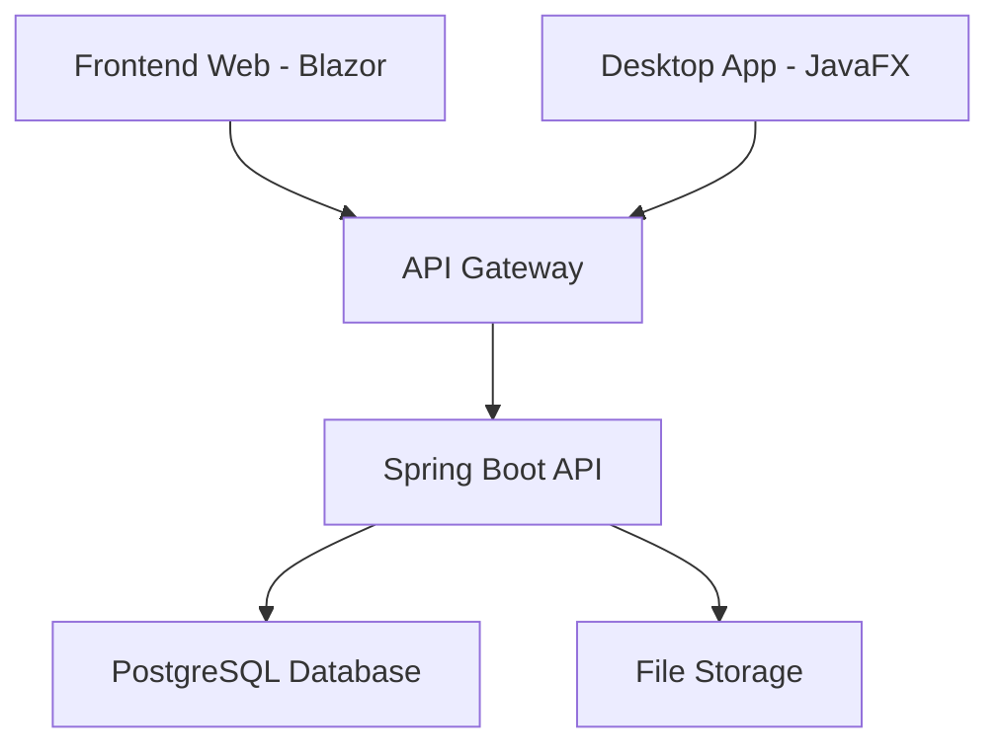

# 🏭 ProdTextil - Sistema de Gestão de Produção Têxtil

<div align="center">


**Sistema empresarial completo para gestão de produção têxtil com arquitetura multi-plataforma**

[Funcionalidades](#-funcionalidades) • [Arquitetura](#-arquitetura)

</div>

---

## 📋 Índice

- [🎯 Sobre o Projeto](#-sobre-o-projeto)
- [✨ Funcionalidades](#-funcionalidades)
- [🏗️ Arquitetura](#️-arquitetura)
- [📁 Estrutura do Projeto](#-estrutura-do-projeto)
- [🚀 Tecnologias Utilizadas](#-tecnologias-utilizadas)
- [🗺️ Roadmap](#️-roadmap)

---

## 🎯 Sobre o Projeto

**ProdTextil** é um sistema empresarial robusto e moderno desenvolvido para otimizar a gestão de produção em empresas têxteis. O projeto implementa uma arquitetura multi-plataforma que oferece interfaces web e desktop, proporcionando flexibilidade e eficiência na gestão de operações empresariais.

### 🔍 Problema Resolvido
- Gestão descentralizada de encomendas e produção
- Falta de visibilidade em tempo real sobre operações
- Dificuldade no controlo de materiais e stock
- Ausência de relatórios e análises detalhadas

### 🎯 Objetivos
- Centralizar a gestão de produção têxtil
- Fornecer dashboards executivos em tempo real
- Automatizar processos de encomendas e tracking
- Implementar sistema de autenticação e autorização robusto

---

## ✨ Funcionalidades

### 🌐 **Frontend Web (Blazor WebAssembly)**
- **🔐 Sistema de Autenticação**
  - Login/Registo com JWT tokens
  - Gestão de sessões seguras
  - Diferentes níveis de acesso (Cliente, Funcionário, Admin)

- **📊 Dashboard Executivo**
  - Métricas em tempo real
  - Indicadores KPI visuais
  - Gráficos interativos de tendências
  - Análise de performance mensal

- **📦 Gestão de Encomendas**
  - Visualização de encomendas por cliente
  - Filtros avançados por período
  - Estados de encomenda (Pendente, Em Produção, Concluído)
  - Detalhes completos de produtos e valores
  - Interface premium com animações fluidas

- **👤 Perfil de Utilizador**
  - Gestão de dados pessoais
  - Histórico de atividades
  - Configurações de conta

### 🖥️ **Aplicação Desktop (JavaFX)**
- **📈 Dashboards Estatísticos**
  - Estatísticas de clientes e fornecedores
  - Análise de materiais e controlo de stock
  - Gráficos de barras interativos
  - Relatórios de encomendas por período

- **📊 Visualizações Avançadas**
  - Charts dinâmicos com JavaFX
  - Filtros e ordenação personalizados
  - Exportação de relatórios
  - Interface nativa optimizada

### 🔙 **Backend API (Spring Boot)**
- **🚀 API RESTful Completa**
  - Endpoints para todas as entidades
  - Documentação automática com Swagger/OpenAPI
  - Validação de dados robusta
  - Tratamento de erros padronizado

- **🗄️ Gestão de Dados**
  - Modelos JPA/Hibernate completos
  - Relacionamentos complexos entre entidades
  - Queries otimizadas
  - Transações ACID

- **🛡️ Segurança**
  - Autenticação JWT stateless
  - Hashing de passwords com BCrypt
  - CORS configurado
  - Validação de entrada

---

## 🏗️ Arquitetura

### 📐 **Padrão Arquitetural**


### 🔄 **Fluxo de Dados**
1. **Autenticação**: JWT tokens para sessões stateless
2. **Comunicação**: REST API com JSON
3. **Persistência**: PostgreSQL com JPA/Hibernate
4. **Caching**: Redis para otimização (roadmap)
5. **Logging**: Sistema de logs estruturado

### 🎨 **Padrões de Design**
- **Repository Pattern**: Abstração da camada de dados
- **DTO Pattern**: Transferência de dados otimizada
- **Service Layer**: Lógica de negócio centralizada
- **MVC**: Separação clara de responsabilidades
- **Dependency Injection**: Inversão de controlo

---

## 📁 Estrutura do Projeto

```
prodTextil/
├── 📁 backend/                     # API Spring Boot
│   ├── 📁 src/main/java/com/ipvc/bll/
│   │   ├── 📁 controllers/         # REST Controllers
│   │   ├── 📁 services/           # Business Logic
│   │   ├── 📁 models/             # JPA Entities
│   │   ├── 📁 repos/              # Repositories
│   │   ├── 📁 dto/                # Data Transfer Objects
│   │   └── 📁 config/             # Configurações
│   ├── 📁 src/main/resources/
│   │   └── application.properties  # Config da aplicação
│   └── pom.xml                    # Maven dependencies
│
├── 📁 web/                        # Frontend Blazor
│   ├── 📁 Pages/                  # Páginas Blazor
│   │   ├── Dashboard.razor        # Dashboard principal
│   │   ├── Login.razor           # Página de login
│   │   ├── Register.razor        # Página de registo
│   │   ├── OrdersDashboard.razor # Gestão de encomendas
│   │   └── Shop.razor            # Loja online
│   ├── 📁 Models/                 # Modelos C#
│   ├── 📁 Services/               # Serviços HTTP
│   ├── 📁 Layout/                 # Layouts partilhados
│   ├── 📁 wwwroot/               # Assets estáticos
│   │   ├── 📁 css/               # Estilos CSS
│   │   └── index.html            # Página principal
│   └── web.csproj                # Projeto .NET
│
├── 📁 desktop/                    # Aplicação JavaFX
│   ├── 📁 src/main/java/com/ipvc/desktop/
│   │   ├── 📁 controller/         # Controllers JavaFX
│   │   ├── 📁 views/             # FXML Files
│   │   ├── 📁 style/             # CSS Styles
│   │   └── 📁 utils/             # Utilitários
│   └── pom.xml                   # Maven dependencies
│
├── pom.xml                       # Maven parent POM
├── README.md                     # Este ficheiro
└── .gitignore                    # Ficheiros ignorados
```

---

## 🚀 Tecnologias Utilizadas

### 🔙 **Backend**
| Tecnologia | Versão | Descrição |
|------------|--------|-----------|
| **Java** | 23 | Linguagem principal |
| **Spring Boot** | 3.4.3 | Framework web |
| **Spring Data JPA** | - | Persistência ORM |
| **PostgreSQL** | - | Base de dados relacional |
| **Maven** | - | Gestão de dependências |
| **SpringDoc OpenAPI** | 2.2.0 | Documentação API |
| **BCrypt** | 0.4 | Criptografia passwords |

### 🌐 **Frontend Web**
| Tecnologia | Versão | Descrição |
|------------|--------|-----------|
| **C#/.NET** | 9.0 | Linguagem e plataforma |
| **Blazor WebAssembly** | 9.0.2 | Framework SPA |
| **Bootstrap** | - | Framework CSS |
| **CSS3** | - | Estilização avançada |
| **JavaScript** | - | Interoperabilidade |

### 🖥️ **Desktop**
| Tecnologia | Versão | Descrição |
|------------|--------|-----------|
| **Java** | 23 | Linguagem principal |
| **JavaFX** | 21.0.2 | Framework GUI |
| **Jackson** | 2.15.3 | Serialização JSON |
| **HttpClient** | - | Comunicação HTTP |

### 🛠️ **Ferramentas**
- **Git** - Controlo de versões
- **VS Code** - Editor de código
- **IntelliJ IDEA** - IDE Java
- **Postman** - Testes de API
- **DBeaver** - Gestão de BD

---


### 🌐 **Frontend Web**

#### 🔐 **Página de Login**
- Interface moderna com glass morphism
- Validação em tempo real
- Animações fluidas

#### 📊 **Dashboard Executivo**
- Métricas KPI em tempo real
- Gráficos interativos
- Design responsivo

#### 📦 **Gestão de Encomendas**
- Lista de encomendas com filtros
- Detalhes completos de produtos
- Estados visuais de progresso

### 🖥️ **Aplicação Desktop**

#### 📈 **Dashboards Estatísticos**
- Gráficos de barras interativos
- Filtros por categoria
- Interface nativa JavaFX

---

## 🗺️ Roadmap

### 📅 **Versão 1.0** ✅ **(Concluída)**
- ✅ API REST completa
- ✅ Frontend web Blazor
- ✅ Aplicação desktop JavaFX
- ✅ Sistema de autenticação
- ✅ Dashboards básicos

## 📊 Status do Projeto

### 🏷️ **Badges do Repositório**
<div align="center">


</div>

###  **Contribuições**


###  📈 **Estatísticas Detalhadas do Repositório**
| Métrica | Valor |
|---------|-------|
| 🔄 **Total de Commits** |  |
| 📅 **Última Atualização** |  |
| 📝 **Linguagens** |  |

### 🔧 **Métricas de Código (Atualizadas Dinamicamente)**

#### 📊 **Contagem de Ficheiros**
| Componente | Quantidade | Descrição |
|------------|------------|-----------|
| ☕ **Classes Java** | **350+** | Total de ficheiros Java no projeto |
| 🏛️ **Entidades JPA** | **24** | Modelos de dados (backend/models/) |
| 🎮 **Controllers REST** | **24** | API endpoints (backend/controllers/) |
| 🖥️ **Controllers JavaFX** | **30** | Controladores desktop (desktop/controller/) |
| 🌐 **Páginas Blazor** | **9** | Componentes frontend (web/Pages/) |
| 📋 **Modelos C#** | **6** | DTOs frontend (web/Models/) |
| 🎨 **Layouts** | **2** | Templates Blazor (web/Layout/) |

#### 📁 **Estrutura Detalhada**
```
📊 Distribuição de Código:
├── 🔙 Backend (Spring Boot)
│   ├── 🏛️ 24 Entidades JPA
│   ├── 🎮 24 Controllers REST
│   ├── 🔧 25+ Services
│   ├── 📦 25+ Repositories
│   └── 📄 30+ DTOs
│
├── 🌐 Frontend Web (Blazor)
│   ├── 📄 9 Páginas/Componentes
│   ├── 📋 6 Modelos C#
│   ├── 🎨 2 Layouts
│   └── 🔧 1 Serviço HTTP
│
└── 🖥️ Desktop (JavaFX)
    ├── 🎮 30 Controllers
    ├── 🎨 30+ Ficheiros FXML
    └── 🎨 20+ Ficheiros CSS
```

#### ⚡ **Performance e Qualidade**
- 🚀 **API Endpoints**: 50+ endpoints REST documentados
- 🗄️ **Tabelas BD**: 24 tabelas relacionais
- 🔐 **Autenticação**: JWT + BCrypt implementado
- 📱 **Responsividade**: Design mobile-first
- 🎨 **UI Components**: 15+ componentes reutilizáveis
- 📊 **Dashboards**: 5 dashboards interativos

### 🏆 **Marcos do Projeto**
- ✅ **Setup Inicial** - Arquitetura multi-módulo Maven
- ✅ **Backend API** - Spring Boot com PostgreSQL
- ✅ **Frontend Web** - Blazor WebAssembly SPA
- ✅ **Desktop App** - JavaFX com dashboards
- ✅ **Autenticação** - Sistema JWT completo
- ✅ **Dashboards** - Métricas e gráficos interativos

---

## 📄 Licença

Este projeto está sob a licença MIT. Veja o arquivo [LICENSE](LICENSE) para mais detalhes.

```
MIT License

Copyright (c) 2025

Permission is hereby granted, free of charge, to any person obtaining a copy
of this software and associated documentation files (the "Software"), to deal
in the Software without restriction, including without limitation the rights
to use, copy, modify, merge, publish, distribute, sublicense, and/or sell
copies of the Software, and to permit persons to whom the Software is
furnished to do so, subject to the following conditions:

The above copyright notice and this permission notice shall be included in all
copies or substantial portions of the Software.
```

---

[⬆ Voltar ao topo](#-prodtextil---sistema-de-gestão-de-produção-têxtil)

</div>
